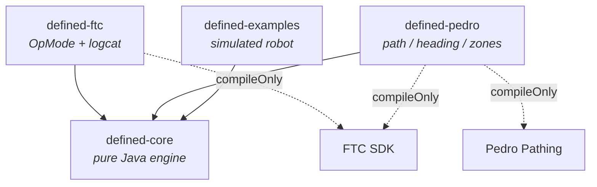
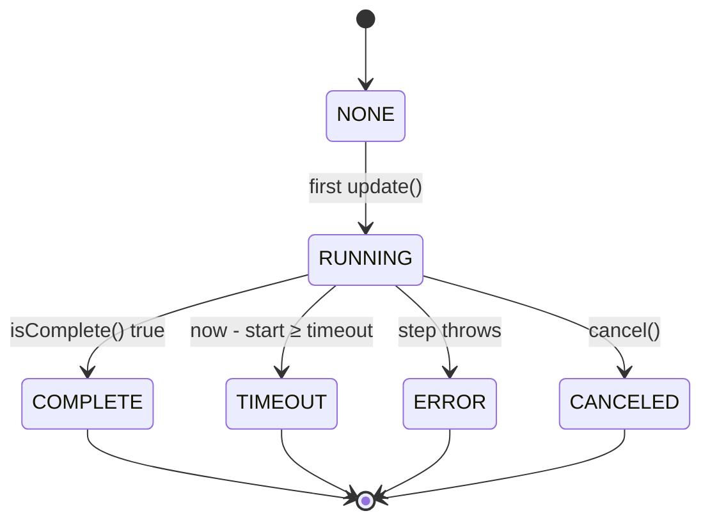

# Defined

**From _Undefined_ to _Defined_** — a tiny, non‑blocking action engine for FTC robots.

[]()
[]()
[]()

Defined lets you express robot behavior as small, composable **actions** that run
incrementally in your main loop — no threads, no blocking, no `sleep()`. Sequence
them, run them in parallel, race them, retry them, guard them, and let a
**slot‑aware runner** make sure two actions never fight over the same subsystem.

It was built and battle‑tested by **FTC Team 19112 (Undefined)** and extracted
here so any team can use it. The core is **pure Java** — it runs and is unit‑tested
on a laptop with zero Android or hardware dependencies.

```java
// One button, one composed behavior: load three balls while spinning up, then fire.
Action scoreThree = new SequentialAction("score_three",
        ParallelAction.all("load_and_spin",
                loadBalls(robot, 3),          // requires INTAKE slot
                spinUp(robot, 300)),          // requires FLYWHEEL slot
        fireAll(robot),                       // requires INDEXER slot
        Action.oneShot("flywheel_off", now -> robot.setFlywheelTarget(0)));

// In your loop:  scoreThree.update(now);
```

---

## Why actions?

A classic FTC `loop()` becomes a tangle of `if`/`else` and boolean flags. Defined
replaces that with declarative building blocks:

- **Non‑blocking** — every action does a sliver of work per `update(now)` and reports
  its state. Your loop stays fast (the Control Hub is resource‑constrained — every
  millisecond counts).
- **Composable** — `SequentialAction`, `ParallelAction`, `RaceGroupAction`,
  `RepeatAction` nest arbitrarily.
- **Deterministic** — time is *injected* (`update(nowMillis)`), so the same inputs
  always produce the same result. That is why the whole engine is unit‑testable on a
  desktop.
- **Safe by construction** — the `ActionRunner` uses **slots** so only one action
  drives a subsystem at a time; conflicts cancel the loser and queue the winner.

---

## Modules

| Artifact | What it is | Depends on |
|---|---|---|
| **`defined-core`** | The engine: `Action`, `Slot`, `ActionRunner`, 32 action types. Pure Java. | — |
| **`defined-ftc`** | FTC glue: logcat bridge, action‑driven `OpMode` base. | FTC SDK |
| **`defined-pedro`** | Pedro Pathing actions: follow a path, lock heading, monitor zones. | Pedro Pathing |
| **`defined-examples`** | A fully simulated robot + runnable demo (desktop, no hardware). | core |



---

## Install

> Not yet published. The snippets below are how consumption will work once the
> first release is cut. See [docs/RELEASING.md](docs/RELEASING.md).

### Gradle (Maven Central, planned)

```gradle
dependencies {
    implementation "com.teamundefined:defined-core:<version>"
    implementation "com.teamundefined:defined-ftc:<version>"     // optional FTC glue
    implementation "com.teamundefined:defined-pedro:<version>"   // optional Pedro actions
}
```

### Gradle (JitPack, zero‑infra fallback)

```gradle
repositories { maven { url 'https://jitpack.io' } }

dependencies {
    implementation "com.github.team-undefined.defined:defined-core:<tag>"
}
```

---

## Quick start

### 1. Declare your subsystem slots

The library ships no hard‑coded subsystem list — you declare your own:

```java
public enum Subsystem implements Slot {
    DRIVE, INTAKE, FLYWHEEL, INDEXER, TURRET
}
```

### 2. Build behaviors from actions

```java
Action aim = Action.until("aim", now -> turret.track(), turret::isOnTarget)
        .requires(Subsystem.TURRET);

Action shoot = new SequentialAction("shoot",
        Action.oneShot("open_gate", now -> indexer.open()),
        WaitUntilAction.until("ball_gone", () -> !indexer.hasBall()),
        Action.oneShot("close_gate", now -> indexer.close()))
        .requires(Subsystem.INDEXER);
```

### 3. Run them in your OpMode

Either tick a single action directly:

```java
public void loop() {
    long now = System.currentTimeMillis();
    shoot.update(now);
}
```

…or let the **runner** arbitrate many at once (recommended):

```java
ActionRunner runner = new ActionRunner();

public void loop() {
    long now = nowMs();
    if (gamepad1.triangle) runner.startGroup(shoot);  // queued if INDEXER is busy
    runner.addMonitor(driveMonitor);                  // slot‑free, runs every loop
    runner.update(now);
}
```

`defined-ftc` gives you an `ActionOpMode` base that owns the runner and clock for you.

---

## The action catalog

All 32 action types, each with a worked, **tested** example in
[`defined-core/src/test`](defined-core/src/test) and documented in
[docs/ACTIONS.md](docs/ACTIONS.md).

| Category | Actions |
|---|---|
| **Composition** | `SequentialAction`, `ParallelAction` (ALL / ANY / ALL_NO_FAIL), `RaceGroupAction`, `RepeatAction` |
| **Control flow** | `IfAction`, `SwitchAction` (+ `ValueSwitch`), `GuardedAction`, `NoOpAction` |
| **Timing & waits** | `WaitAction`, `WaitUntilAction`, `TimeoutAction`, `DeadlineAction`, `Continuous`, `HoldAction` |
| **Driver input** | `EdgeTriggerAction`, `ToggleAction`, `DoubleTapAction`, `DebounceAction`, `LatchAction` |
| **Error handling** | `TryAction`, `FailsafeAction`, `FailFastAction`, `EnsureAction`, `RequireAction`, `FinallyAction` |
| **Rate control** | `RateLimitAction`, `ThrottledAction` |
| **Reliability & monitoring** | `WatchdogAction`, `CancelOnAction`, `ManualOverrideAction`, `RetryUntilConfidentAction`, `MetricAction` |
| **Runner helpers** | `ActionRunner`, `ToggleStartGroupAction`, `WhilePressedAction` |
| **Pedro** (`defined-pedro`) | `NavigationAction` (+ `Waypoint`), `FollowPathAction`, `HeadingLockAction`, `ZoneMonitor`, `PathUtils` |

---

## The action state machine

Every action is a small state machine driven by `update(nowMillis)`:



See [docs/ARCHITECTURE.md](docs/ARCHITECTURE.md) for the runner's slot‑arbitration
flow and more diagrams.

---

## Try it now (no robot required)

```bash
./gradlew :defined-examples:run     # runs a simulated match (auto + teleop)
./gradlew test                      # runs all 80 unit tests
./gradlew build                     # builds every module incl. the Android AARs
```

---

## Contributing

Issues and PRs welcome — see [CONTRIBUTING.md](CONTRIBUTING.md). Every action ships
with a deterministic test; please keep that bar.

## License

[MIT](LICENSE) © FTC Team 19112 — Undefined. Built for the FTC community. 🤝
