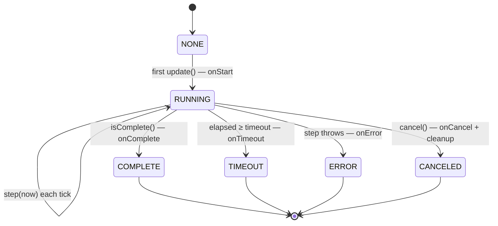
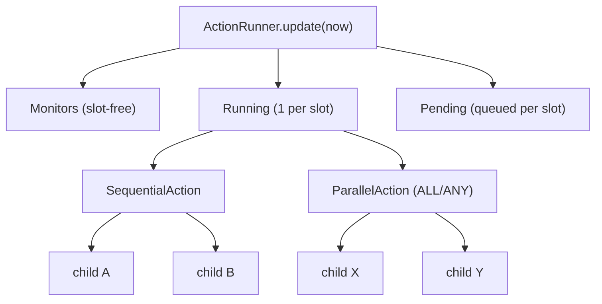

# defined-core

The pure‑Java heart of Defined — the action engine. No Android, no FTC SDK, no
hardware: it compiles and unit‑tests on any laptop, and adds ~zero overhead on the
Control Hub. Everything else (`defined-ftc`, `defined-pedro`) builds on this.

```gradle
implementation 'com.teamundefined:defined-core:0.1.0'
```

## What's inside

| Type | Role |
|---|---|
| **`Action`** | The non‑blocking state machine every behavior is built from. |
| **`Slot`** | Marker interface; you declare subsystems as an `enum implements Slot`. |
| **`ActionRunner`** | Ticks monitors + arbitrates slot‑managed actions each loop. |
| **`Log`** | Zero‑overhead pluggable logging facade (no‑op until a sink is installed). |
| **`generic.*`** | 32 composable action types (see [docs/ACTIONS.md](../docs/ACTIONS.md)). |
| **`runner.*`** | `ActionRunner`, `ToggleStartGroupAction`, `WhilePressedAction`. |

## The `Action` state machine

Driven entirely by `update(nowMillis)` — time is *injected*, so behavior is
deterministic and testable.



## Composition + the runner

Composites are just actions that own child actions; the runner keeps one action per
slot and queues conflicts.



## 60‑second example

```java
enum Sub implements Slot { DRIVE, FLYWHEEL, INDEXER }

Action shoot = new SequentialAction("shoot",
        Action.oneShot("open", now -> indexer.open()),
        WaitUntilAction.until("empty", () -> indexer.balls() == 0),
        Action.oneShot("close", now -> indexer.close()))
        .requires(Sub.INDEXER);

ActionRunner runner = new ActionRunner();
// each loop:
runner.startGroup(shoot);     // queued automatically if INDEXER is busy
runner.update(nowMillis);
```

## Build & test

```bash
./gradlew :defined-core:test     # ~76 deterministic tests, no Android needed
```
