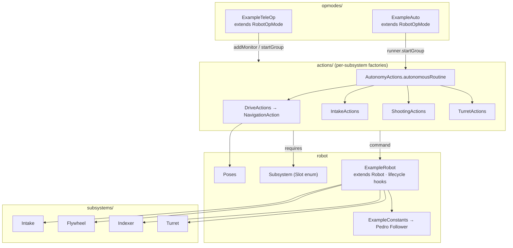
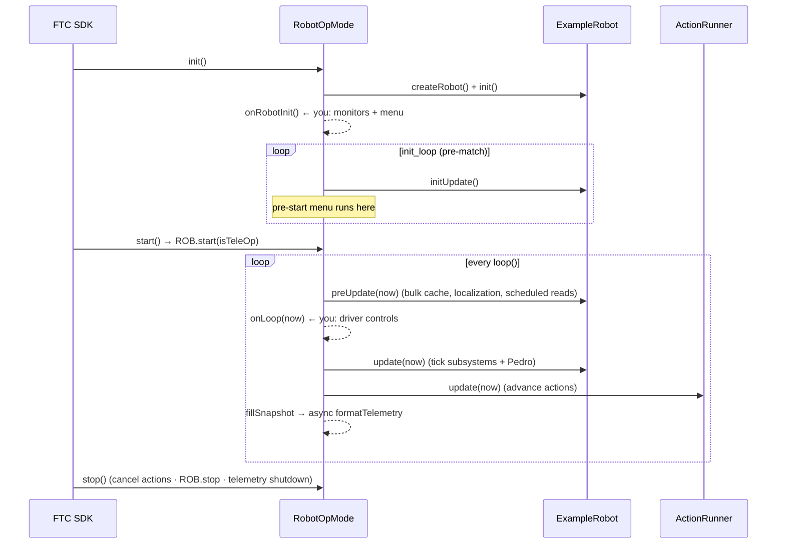

# defined-example-ftc

A **realistic FTC robot** built with Defined — the template to copy into your own
TeamCode. It mirrors a real team's structure exactly and uses the **actual**
`NavigationAction`, the `Robot` + `RobotOpMode` lifecycle, the driver‑station
pre‑start menu, async telemetry, and the profiler / system‑monitor / hardware‑scheduler
utilities. It compiles against the FTC SDK + Pedro (so it's CI‑checked), but it drives
real hardware, so it isn't meant to run on a desktop.

> Want a version you can run on a laptop? See [`defined-examples`](../defined-examples)
> (a hardware‑free demo of the core engine and slot model). **This** module is what you
> clone for a real robot — it's the one that shows every feature working together.

## What it demonstrates

- **`ExampleRobot extends Robot`** — the lifecycle contract. `RobotOpMode` calls its
  hooks in order every loop, so there is no hand‑written `init()`/`loop()`/`stop()`
  plumbing. It wires bulk‑cache clearing, a `HardwareScheduler` for expensive reads, a
  `SectionProfiler`, and a `SystemMonitor`.
- **`ExampleTeleOp extends RobotOpMode<ExampleRobot>`** — controls in `onLoop`, monitors
  and the pre‑start menu in `onRobotInit`, and the two‑stage async telemetry pipeline
  (`fillSnapshot` captures on the loop thread, `formatTelemetry` lays out on a
  background thread).
- **`ExampleAuto extends RobotOpMode<ExampleRobot>`** — same base, no `onLoop` at all:
  the base ticks the robot and runner, and the composed routine does the rest.
- **`ExampleConfig`** — the field‑editable settings the menu drives.

## Structure (mirrors real TeamCode)



## The loop (RobotOpMode)

`RobotOpMode` owns the ordering. You never call `robot.update()` or `runner.update()`
yourself — you fill in the hooks (bold), and the base runs everything around them each
loop. This is the ordering that keeps a fresh pose in front of your logic and hardware
writes behind it.



## How it maps to your project

| This module | Your TeamCode |
|---|---|
| `ExampleRobot` (extends `Robot`) | your `Robot.java` (extends `Robot`) |
| `Subsystem` (enum) | your `Slot` enum |
| `subsystems/*` | your hardware wrappers |
| `ExampleConstants` | your `pedroPathing/Constants.java` |
| `Poses` | your `Poses.java` |
| `actions/*Actions` | your `builders/specialized/*Actions` |
| `opmodes/ExampleTeleOp` / `ExampleAuto` (extend `RobotOpMode`) | your `@TeleOp` / `@Autonomous` |

## Configure / build

Hardware names used: `flywheel1`, `flywheel2`, `angle`, `intakeLeft`, `intakeRight`,
`leftGate`, `centerGate`, `rightGate`, `turret`, drive motors `leftFront`/`leftBack`/
`rightFront`/`rightBack`, and `pinpoint`. Rename in `ExampleRobot`/`ExampleConstants`
to match your config.

```bash
./gradlew :defined-example-ftc:assembleRelease   # compiles against FTC SDK + Pedro
```
