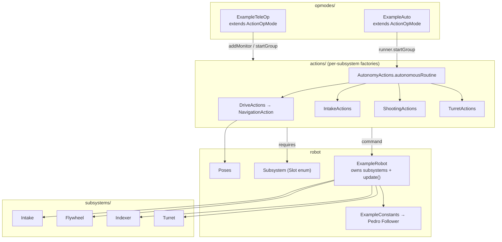
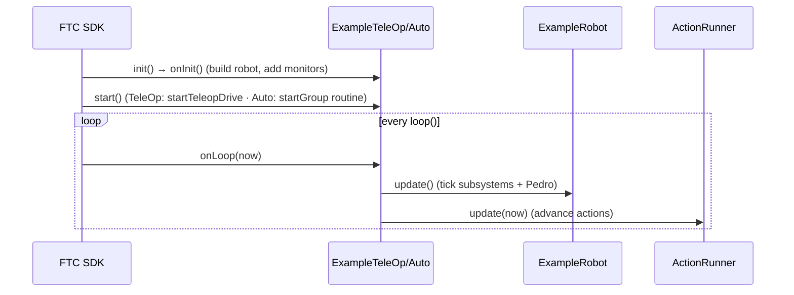

# defined-example-ftc

A **realistic FTC robot** built with Defined — the template to copy into your own
TeamCode. It mirrors a real team's structure exactly and uses the **actual**
`NavigationAction`, the `ActionOpMode` lifecycle, and per‑subsystem `*Actions`
factories. It compiles against the FTC SDK + Pedro (so it's CI‑checked), but it
drives real hardware, so it isn't meant to run on a desktop.

> Want a version you can run on a laptop? See [`defined-examples`](../defined-examples)
> (a simulated robot for understanding the engine). **This** module is what you clone
> for a real robot.

## Structure (mirrors real TeamCode)



## The loop (ActionOpMode)



## How it maps to your project

| This module | Your TeamCode |
|---|---|
| `ExampleRobot` | `Robot.java` |
| `Subsystem` (enum) | your `Slot` enum |
| `subsystems/*` | your hardware wrappers |
| `ExampleConstants` | your `pedroPathing/Constants.java` |
| `Poses` | your `Poses.java` |
| `actions/*Actions` | your `builders/specialized/*Actions` |
| `opmodes/ExampleTeleOp` / `ExampleAuto` | your `@TeleOp` / `@Autonomous` |

## Configure / build

Hardware names used: `flywheel1`, `flywheel2`, `angle`, `intakeLeft`, `intakeRight`,
`leftGate`, `centerGate`, `rightGate`, `turret`, drive motors `leftFront`/`leftBack`/
`rightFront`/`rightBack`, and `pinpoint`. Rename in `ExampleRobot`/`ExampleConstants`
to match your config.

```bash
./gradlew :defined-example-ftc:assembleRelease   # compiles against FTC SDK + Pedro
```
