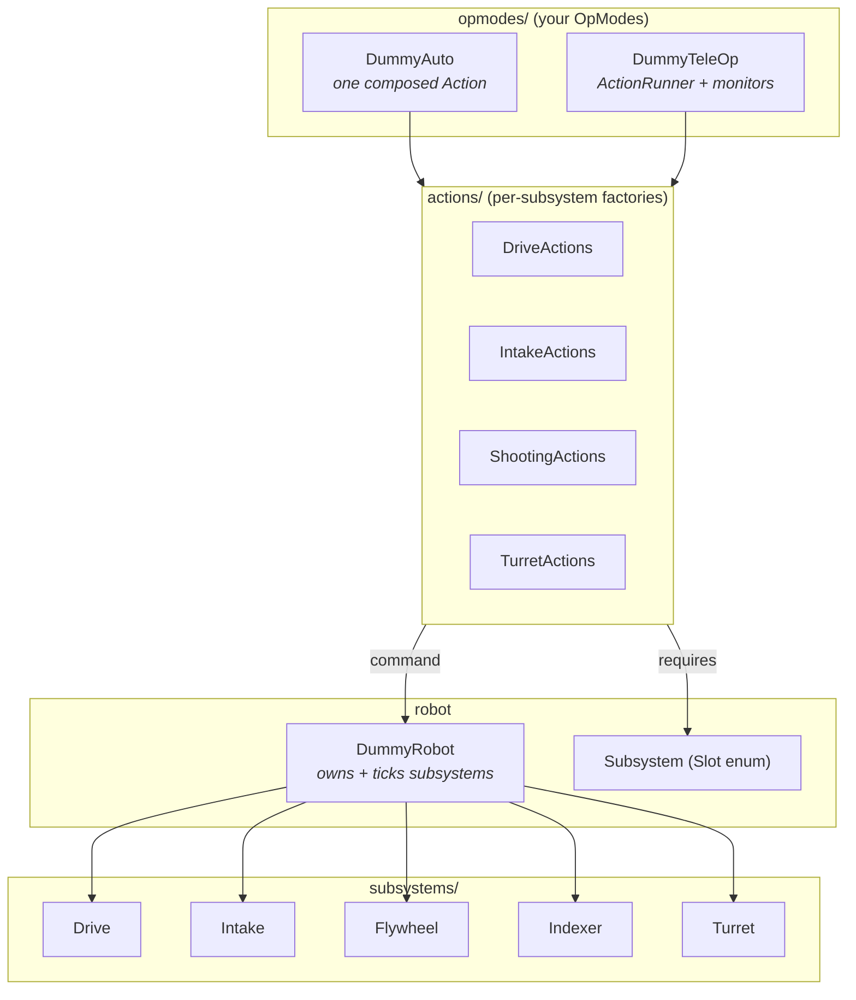
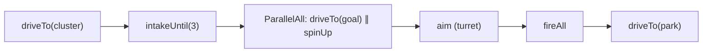
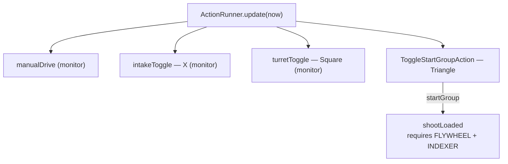

# defined-examples (desktop engine demo)

> **Looking for the realistic robot to copy?** See **[`defined-example-ftc`](../defined-example-ftc)** —
> it mirrors real TeamCode (real subsystems, the actual `NavigationAction`, the
> `ActionOpMode` lifecycle, TeleOp + Auto) and compiles against the FTC SDK + Pedro.
>
> **This** module is the hardware‑free version: a **simulated** robot so you can *run
> and unit‑test the engine on a laptop*. Its `driveTo` is a desktop stand‑in for
> `NavigationAction`. Use it to understand the engine + slot model; use
> `defined-example-ftc` as the template for your robot.

A simulated robot showing the same structure — subsystems, per‑subsystem action
factories, and an Auto + a TeleOp — that **runs and is tested on a laptop** (no hardware).

```bash
./gradlew :defined-examples:run     # play a full simulated match (auto, then teleop)
./gradlew :defined-examples:test    # prove auto + teleop actually score
```

## How it's organized (copy this shape into your TeamCode)



| Layer | Files | Maps to your TeamCode as… |
|---|---|---|
| **subsystems/** | `Drive`, `Intake`, `Flywheel`, `Indexer`, `Turret` | your hardware wrappers |
| **robot** | `DummyRobot`, `Subsystem` | `Robot.java` + your `Slot` enum |
| **actions/** | `DriveActions`, `IntakeActions`, `ShootingActions`, `TurretActions` | your `*Actions` builders |
| **opmodes/** | `DummyAuto`, `DummyTeleOp` | your `@Autonomous` / `@TeleOp` |

## Autonomous = one composed action



## TeleOp = runner + monitors + a button‑started group



## Going from this to a real robot

1. Replace each `subsystems/*` class with your real hardware (`DcMotor`, `Servo`, …).
2. Keep the `actions/*` factories almost as‑is — they're already Defined actions.
3. Make `DummyTeleOp`/`DummyAuto` extend the FTC SDK (`OpMode`, or
   `ActionOpMode` from [`defined-ftc`](../defined-ftc)) and feed real `gamepad1.*`.
4. Swap `DriveActions.driveTo` for the Pedro `NavigationAction` from
   [`defined-pedro`](../defined-pedro).

The action structure — and the slot safety — stays identical.
