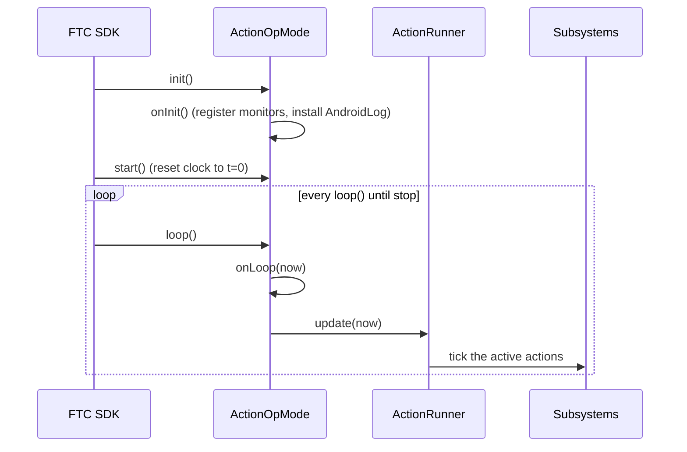

# defined-ftc

The thin FTC SDK adapter — it plugs the pure‑Java [`defined-core`](../defined-core)
engine into a real OpMode. An Android library (AAR).

```gradle
implementation 'com.teamundefined:defined-ftc:0.1.0'
```

> The FTC SDK is declared `compileOnly`, so this links against **your TeamCode's
> existing SDK version** — no duplicate/conflicting copies.

## What it gives you

| Type | Role |
|---|---|
| **`ActionOpMode`** | An `OpMode` base that owns an `ActionRunner` + a monotonic clock and ticks it every loop. |
| **`AndroidLog`** | One call routes the core `Log` facade to logcat (off by default = zero cost). |
| **`samples.SampleTeleOp`** | A complete, compiling example TeleOp. |

## How it fits the OpMode lifecycle



## Minimal OpMode

```java
@TeleOp(name = "My TeleOp")
public class MyTeleOp extends ActionOpMode {
    enum Sub implements Slot { INTAKE }
    private DcMotor intake;

    @Override protected void onInit() {
        AndroidLog.install();
        intake = hardwareMap.get(DcMotor.class, "intake");
        runner.addMonitor(ToggleAction.onPress("intake", () -> gamepad1.cross,
                Action.oneShot("on",  n -> intake.setPower(1.0)),
                Action.oneShot("off", n -> intake.setPower(0.0))));
    }
    // ActionOpMode.loop() ticks the runner for you.
}
```

See [`samples/SampleTeleOp.java`](src/main/java/com/teamundefined/defined/ftc/samples/SampleTeleOp.java)
for a fuller example (intake toggle + one‑button shoot group).

## Build

```bash
./gradlew :defined-ftc:assembleRelease   # needs the Android SDK (local.properties)
```
