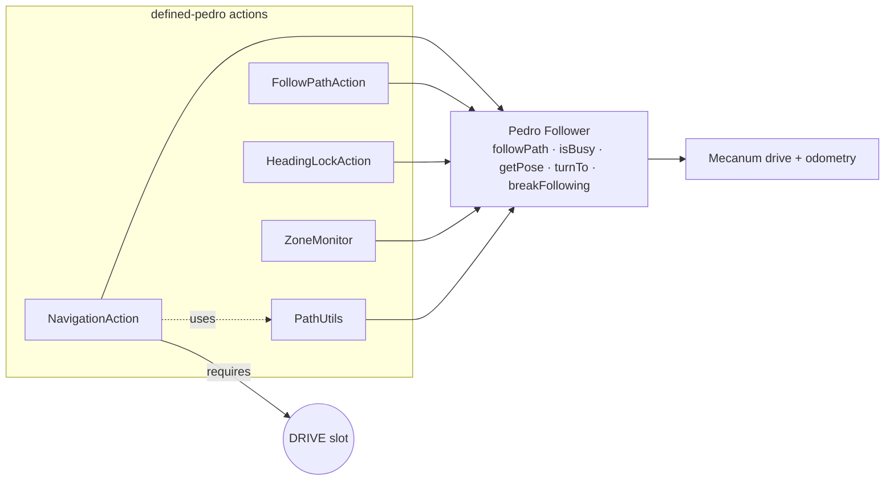
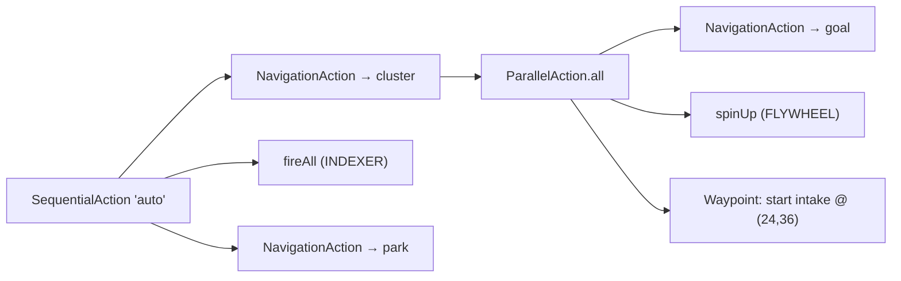

# defined-pedro

Pedro Pathing actions for Defined — path‑following, heading lock, and zone awareness
expressed as composable [`defined-core`](../defined-core) actions. An Android library
(AAR).

```gradle
implementation 'com.teamundefined:defined-pedro:0.1.0'
```

> Pedro and the FTC SDK are `compileOnly` — this links against the **Pedro version
> your TeamCode already uses** (most teams already depend on Pedro).

## What it gives you

| Type | Role |
|---|---|
| **`NavigationAction`** | Full drive‑to action: A→B, pre‑built/deferred `PathChain`, optimized minimal‑strafe paths, **joystick override**, **waypoint callbacks**, heading‑tolerant completion. |
| **`FollowPathAction`** | Lighter "run this `PathChain` to completion" action. |
| **`HeadingLockAction`** | Field‑centric heading control that cooperates with Pedro's heading PID. |
| **`ZoneMonitor`** | Fire callbacks on entering/leaving a rectangular field zone. |
| **`PathUtils`** | `buildOptimizedPath` / `detectOptimalDriveDirection`. |

## How it sits on Pedro

Each action just drives a Pedro `Follower`; the DRIVE slot keeps navigation
exclusive, and everything composes inside `SequentialAction`/`ParallelAction`.



## Composing an autonomous



```java
Action auto = new SequentialAction("auto",
    NavigationAction.forAuto(follower, new Pose(24, 36, 0)).requiresDrive(Sub.DRIVE),
    intakeUntil(3),
    ParallelAction.all("approach",
        NavigationAction.forAutoOptimized(follower, goalPose, 0.3, 0.8).requiresDrive(Sub.DRIVE),
        spinUp()),
    fireAll());
// remember to call follower.update() every loop
```

## Build

```bash
./gradlew :defined-pedro:assembleRelease   # needs the Android SDK + Pedro repo
```
