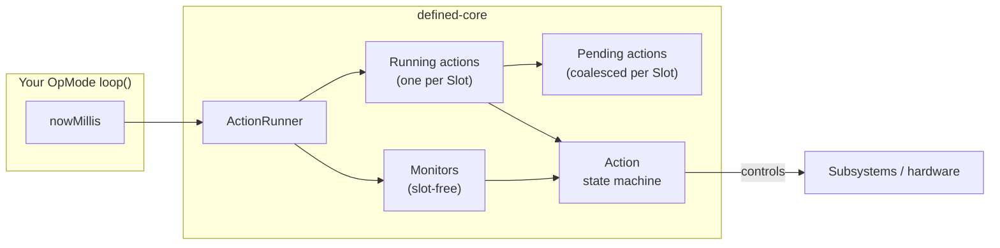
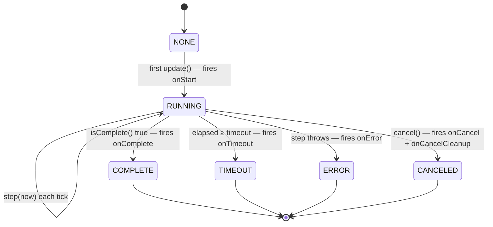
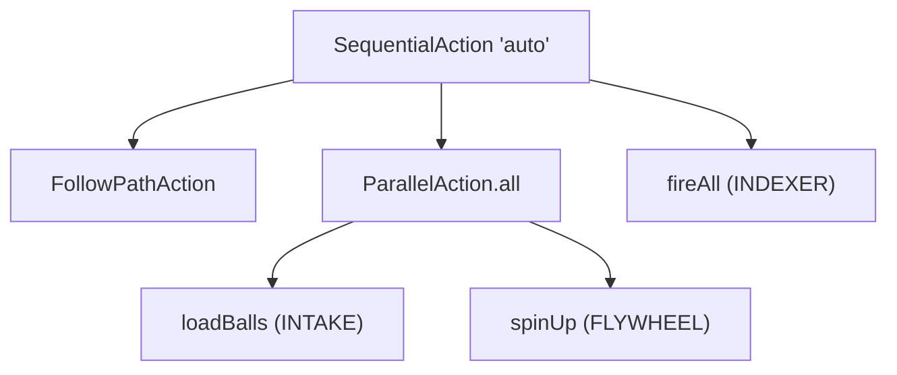
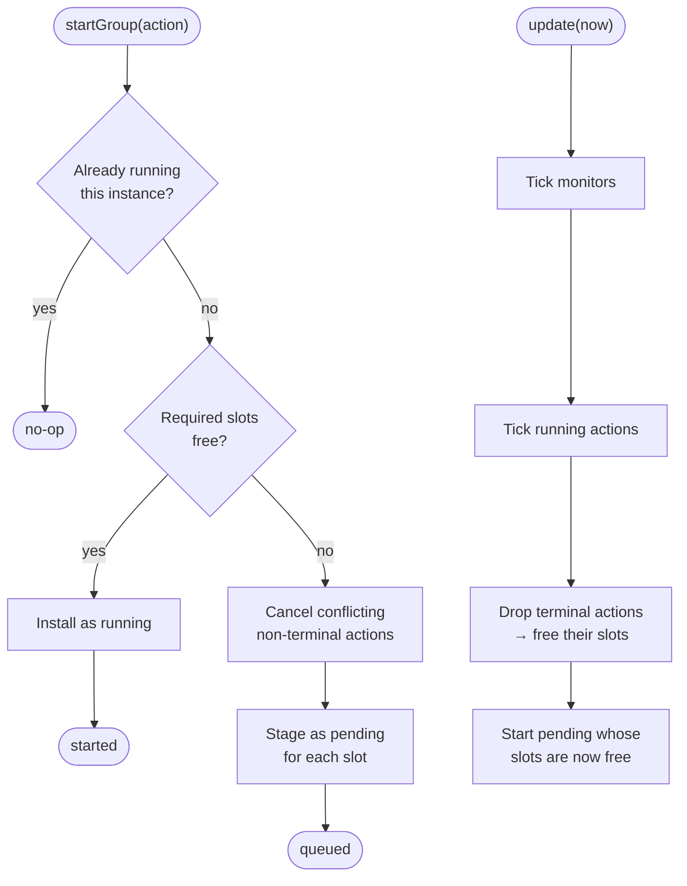
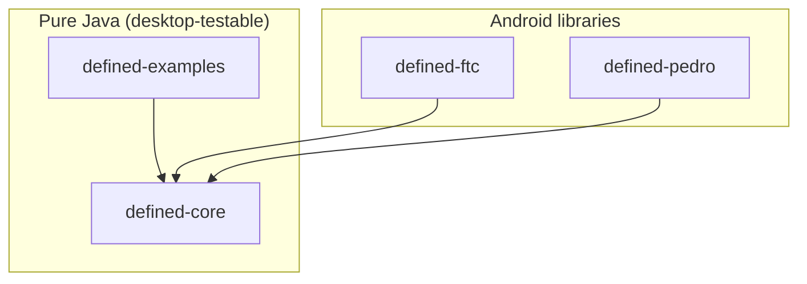

# Architecture

Defined is intentionally small. There are exactly three core concepts —
**`Action`**, **`Slot`**, and **`ActionRunner`** — and everything else is an
`Action` subclass that composes or decorates other actions.

## The big picture



Your loop feeds a timestamp to the runner. The runner ticks every monitor and
every running action exactly once. Each `Action` advances its own state machine
and pokes hardware through plain Java lambdas you supply.

## 1. `Action` — the state machine

An `Action` holds a `step` (what to do each tick) and an optional `isComplete`
predicate. `update(nowMillis)` runs the step, checks for timeout/completion, and
fires lifecycle callbacks.



Key properties:

- **Terminal is sticky.** Once `COMPLETE`/`TIMEOUT`/`ERROR`/`CANCELED`, further
  `update()` calls are no‑ops until `reset()`.
- **Time is injected.** Nothing reads the wall clock; you pass `nowMillis`. This is
  what makes the engine deterministic and desktop‑testable.
- **Callbacks chain.** `withOnComplete(...)` adds to existing callbacks rather than
  replacing them.
- **Reusable.** `reset()` returns an action to `NONE` so you can run it again.

### Composites

`SequentialAction`, `ParallelAction`, `RepeatAction`, etc. are just actions that
own child actions and call the children's `update(now)` from their own `step`.
Failure/timeout/cancel propagate according to each composite's contract.



## 2. `Slot` — cooperative resource locking

`Slot` is an empty marker interface. Teams declare their own subsystems as an
`enum implements Slot`. An action declares the subsystems it controls with
`.requires(...)`, and the runner guarantees exclusivity.

```java
public enum Subsystem implements Slot { DRIVE, INTAKE, FLYWHEEL, INDEXER }
```

## 3. `ActionRunner` — arbitration

The runner manages three buckets:

- **monitors** — slot‑free actions that tick every loop (drive control, toggles).
- **running** — at most one action per slot.
- **pending** — at most one queued action per slot (newer replaces older).



This is why `FinallyAction` composes so well with the runner: a cancelled action
keeps holding its slots while its cleanup runs, so the next action can't barge in
until cleanup finishes.

## Module layout



- **core** stays pure Java so it builds and tests anywhere, and so the engine has
  zero overhead on the robot (the `Log` facade is a no‑op until a sink is installed).
- **ftc** and **pedro** are thin Android adapters; both declare their heavy
  dependencies as `compileOnly` because the robot app already bundles them.

## Performance notes

- No allocations in the hot path: the runner iterates with indexed loops and reuses
  collections.
- Logging is free unless enabled — `Log.sink` is `null` by default and message
  suppliers are never evaluated.
- One `update(now)` per action per loop; composites add only the cost of their
  active children.
